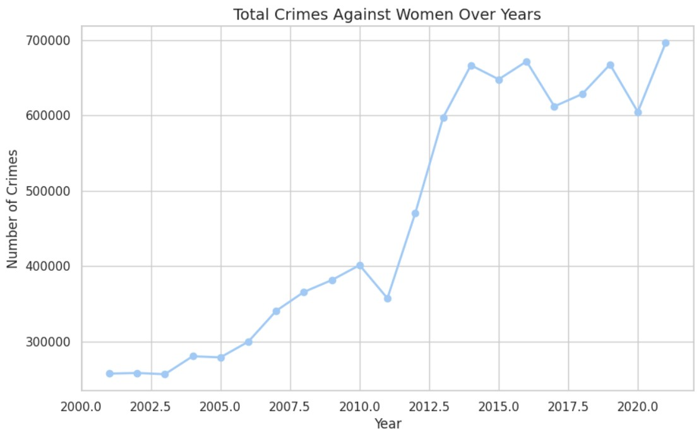
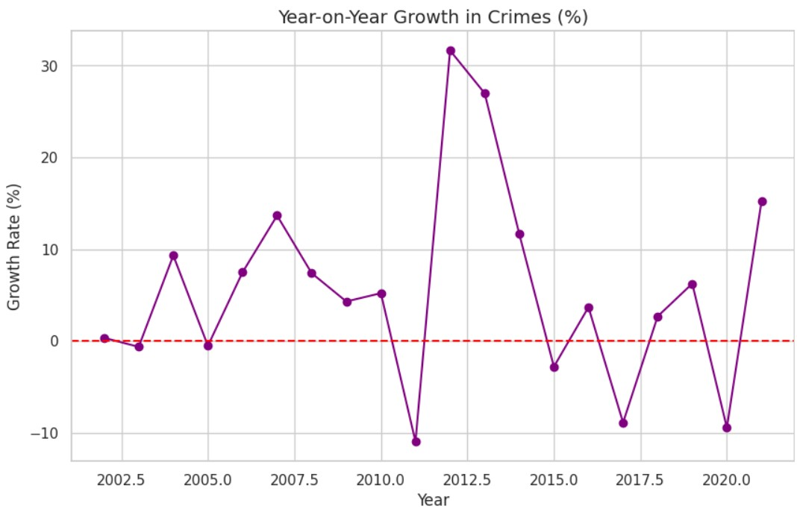
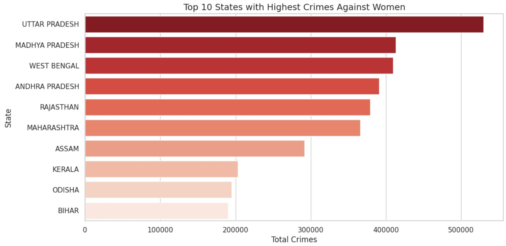
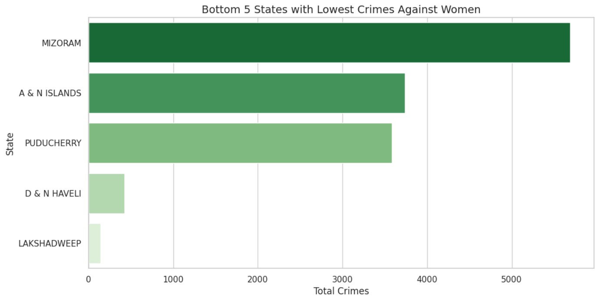
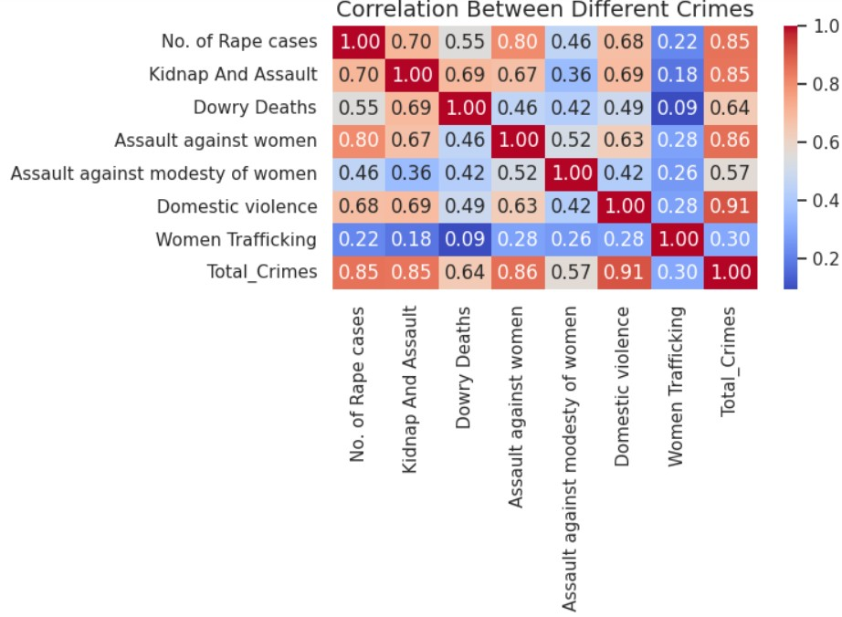
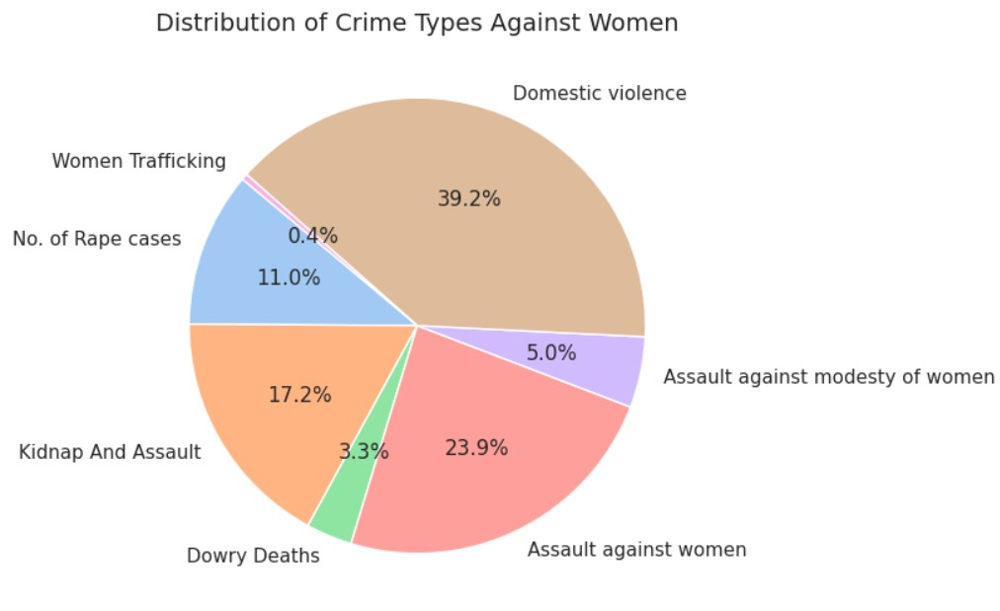
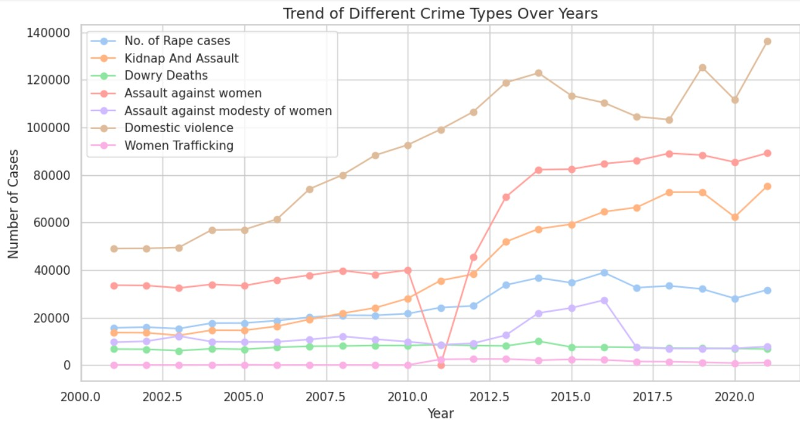
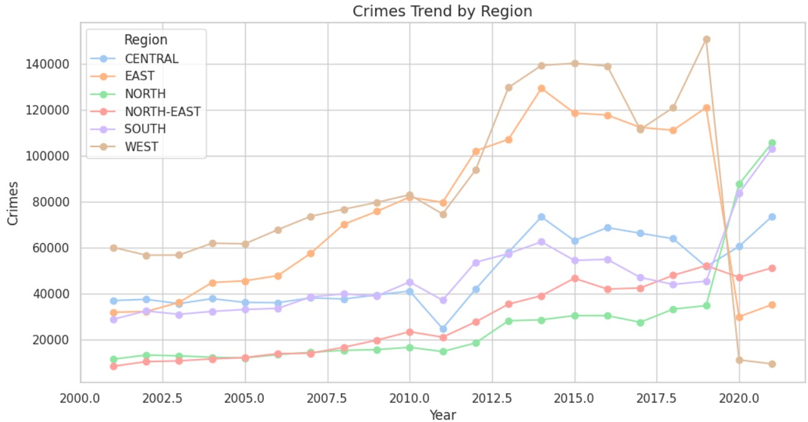

**👩‍🦰 Crimes Against Women Data Analysis  **

📊 **Crimes Against Women Insights (Python & Visualization)**  
This project analyzes crimes against women in India using Python.  
The dataset contains crime data across **states and years**, covering categories such as **rape, kidnapping, dowry deaths, domestic violence, assault, and more**.  

The goal is to explore **crime trends, regional patterns, state-wise variations, and category-wise insights** using data analysis and visualizations.  
---
**📊 Features ** 
➡️ **Data Cleaning & Preprocessing**  
- Removed duplicate rows and unnecessary columns  
- Handled missing values  
- Standardized state names  
- Added `Total_Crimes` column  

➡️ **Yearly Trend Analysis**  
- Line chart showing total crimes over the years  
- Year-on-Year growth rates  

➡️ **State-Wise Analysis**  
- Top 10 states with highest crimes (bar chart)  
- Bottom 5 states with lowest crimes (bar chart)  

➡️ **Crime Type Analysis**  
- Pie chart showing share of different crimes  
- Multi-line chart for category-wise crime trends  

➡️ **Correlation & Heatmaps**  
- Correlation heatmap between different crime categories  
- State vs Year heatmap to compare crimes across geography and time  

➡️ **Regional Trends**  
- Crimes grouped by region (North, South, East, West, Central, North-East)  
---
**📷 Visualizations ** 

Here are some visuals generated in the project:  

- 📈 Crimes Trend Over the Years
  
- 📈 Year on Year Growth in Crime
  
- 📊 Top 10 States with Highest Crimes
  
- 📊 Bottom 5 States with Lowest Crimes
  
- 🔥 Correlation Heatmap
  
- 🥧 Distribution of Crime Types Against Women
   
- 🗺 State vs Year Heatmap
  
- 📈 Trend of Different Crime Types Over the Years
    
- 🌍 Regional Trend Line Chart
      
---
**🛠️ Built With ** 
- **Python (Pandas, NumPy)** – Data handling and preprocessing  
- **Matplotlib & Seaborn** – Data visualization  
- **CSV Dataset** – Crimes data source  
---
**🛠 How to Use This Project ** 
1. Download the repository.  
2. Make sure you have Python installed (>=3.8).  
3. Install dependencies: pip install pandas numpy matplotlib seaborn
---
**🧑‍💻** Author****
This project is created by Tanisha Madisetty.
Feel free to check out my other work or connect with me!
